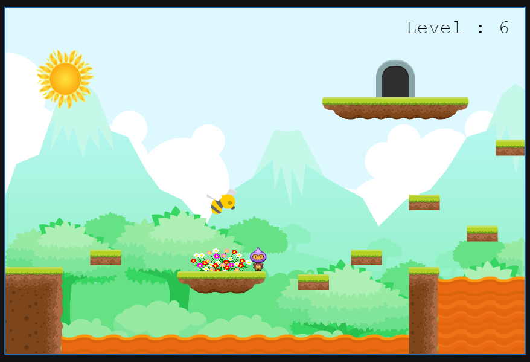

# Jungle Dash

Jungle dash is my Phaser 3 game. It's available to play on itch.io [here](https://itspyguru.itch.io/jungledash)

  

## How to run locally

* Download the source code from [here](https://downgit.github.io/#/home?url=https://github.com/pyGuru123/Phaser-Games/tree/main/Jungle%20Dash)
* Extract the zip file.
* Start localhost in the game directory
* Open localhost in your browser to start playing

 
<h3 align="center"> Show ❤️ By Starring this </h3>
